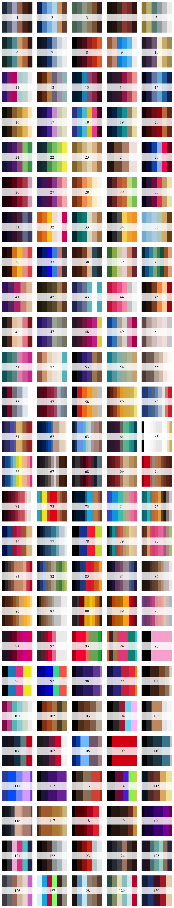
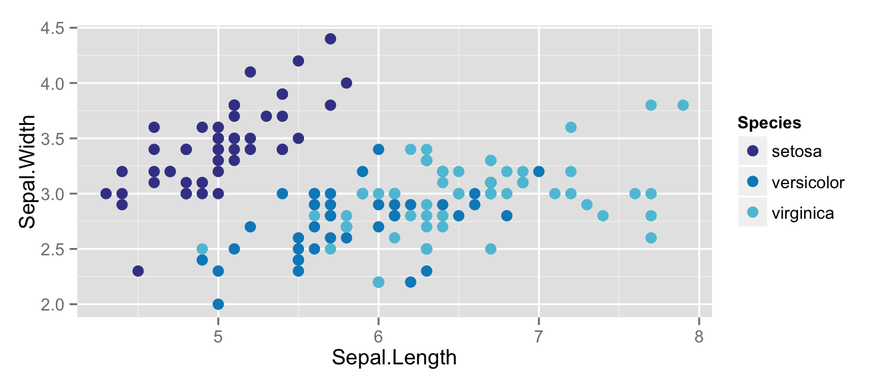
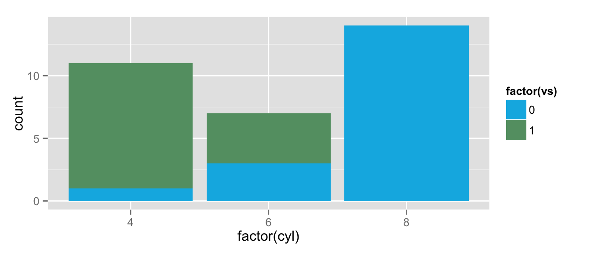
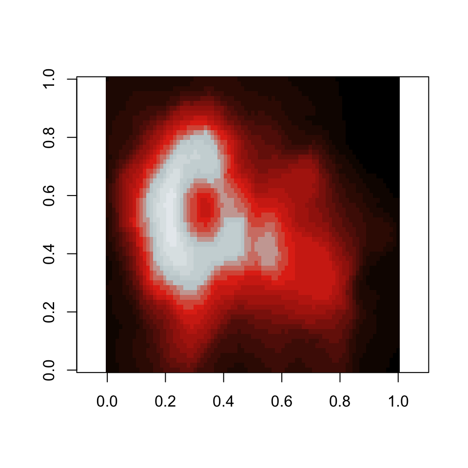
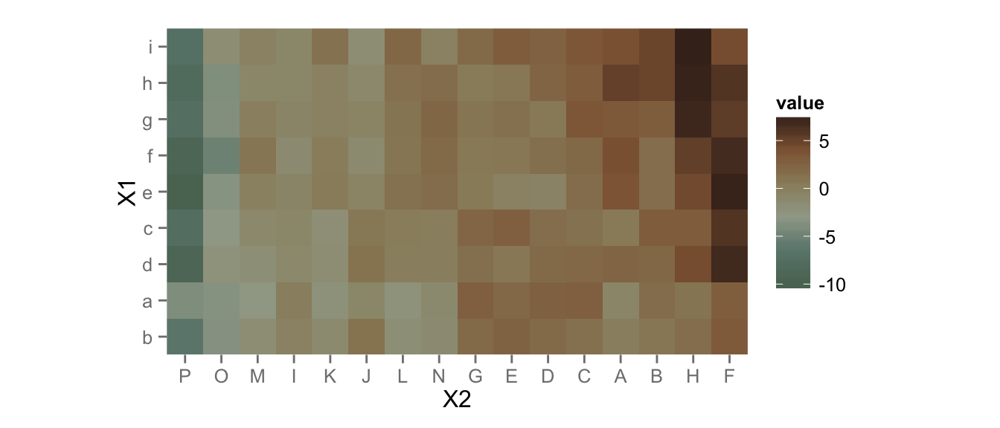

---
---

<!-- README.md is generated from README.Rmd. Please edit that file -->


# Beyoncé Palettes

This is a shameless theft/mashup of:

1. [Brendan Hurr's idea](https://twitter.com/bhive01/status/663910585461968896) ([also Karthik's](https://twitter.com/_inundata/status/663910271212122112)) from [Noam Ross's tweet](https://twitter.com/noamross/status/663907049244196864)
2. Code from [Karthik Ram's `wesanderson` palette](https://github.com/karthik/wesanderson)
3. **Foremost**: the 130 amazing palettes from [beyoncepalettes.tumblr.com](http://beyoncepalettes.tumblr.com/)

**Note**: I am (red-green) colourblind. I have no idea whether these colours make sense for data visualisation. Maybe [use `viridis`](https://github.com/sjmgarnier/viridis) if you want people like me to be able to see your plots :)

## Installation

```R
devtools::install_github("dill/beyonce")
```

## Usage


```r
library(beyonce)
```


```r
par(mfrow=c(26,5))
for(i in 1:130) print(beyonce_palette(i))
```




```r
library(ggplot2)
ggplot(iris, aes(Sepal.Length, Sepal.Width, color = Species)) +
  geom_point(size = 3) +
  scale_color_manual(values = beyonce_palette(18)) +
  theme_gray()
```




```r
qplot(factor(cyl), data=mtcars, geom="bar", fill=factor(vs)) +
  scale_fill_manual(values = beyonce_palette(72))
```




```r
pal <- beyonce_palette(123, 21, type = "continuous")
image(volcano, col = pal, asp=1)
```




```r
pal <- beyonce_palette(3, 100, type = "continuous")
# heatmap is a local dataset
ggplot(heatmap, aes(x = X2, y = X1, fill = value)) +
  geom_tile() +
  scale_fill_gradientn(colours = pal) +
  scale_x_discrete(expand = c(0, 0)) +
  scale_y_discrete(expand = c(0, 0)) +
  coord_equal()
```




With apologies, DLM
